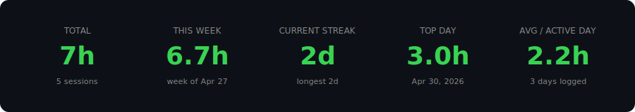
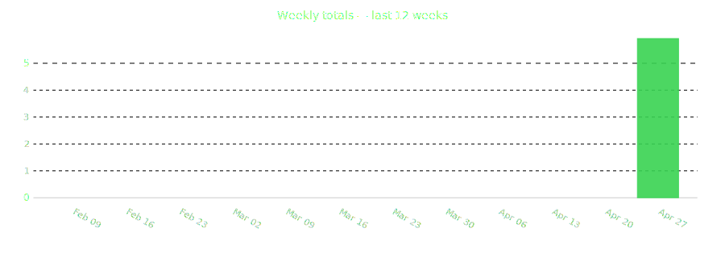
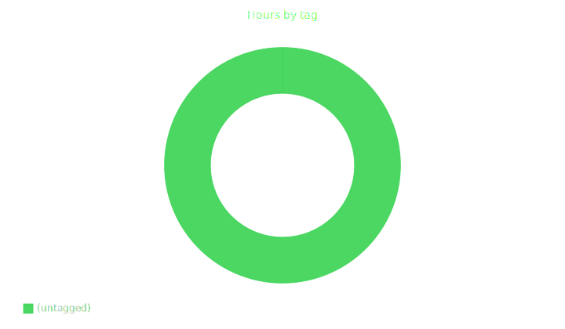
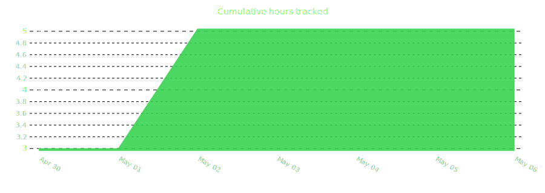
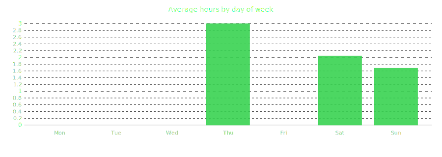
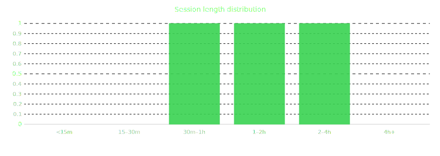
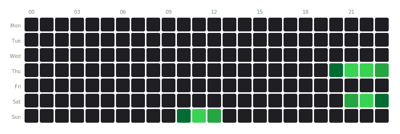

# Charts

Each chart is a standalone SVG — no JS, no external CSS — so it embeds in any
Markdown file and renders on GitHub.

```bash
punch chart <name>           # writes .punch/charts/<name>.svg
punch chart <name> --stdout  # SVG to stdout
punch chart --all
punch chart --list
punch chart --list-styles
```

Previews below were rendered from this repo's own `.punch/` data.

Some charts are date-relative and drift as time passes. A committed
`stats.svg` showing "this week: 12h" is wrong a week later. 🟢 = safe to
commit, 🟡 = looks right only just after `punch out`.

| Chart | | Notes |
|-------|---|-------|
| [heatmap](#heatmap) | 🟡 | rolling 53 weeks |
| [lifetime](#lifetime) | 🟢 | all-time big numbers |
| [stats](#stats) | 🟡 | includes "this week" |
| [weekly](#weekly) | 🟡 | last 12 weeks |
| [tag_donut](#tag_donut) | 🟢 | hours by tag |
| [cumulative](#cumulative) | 🟢 | monotonic |
| [dow_bars](#dow_bars) | 🟢 | avg by weekday |
| [session_length](#session_length) | 🟢 | duration histogram |
| [hour_of_day](#hour_of_day) | 🟢 | 7×24 heatmap |

---

## heatmap

GitHub-style contribution wall. One square per day, intensity = hours logged.


```toml
[charts.heatmap]
weeks = 53
```

---

## lifetime

Five-column block: total · days tracked · longest streak · top day · top tag.
No "this week" or "current streak", so it doesn't go stale.


---

## stats

Five-column block: total · this week · current streak · top day · avg per
active day. Denser than `lifetime` but stale once the week rolls over.



---

## weekly

Bar chart of weekly totals, last 12 weeks.



---

## tag_donut

Hours by tag, all-time. Top 8 shown; rest collapse into `other`. Untagged
sessions shown separately.



---

## cumulative

Filled line of cumulative hours since your first session. Width auto-scales
to history length.



---

## dow_bars

Average hours per weekday (Mon–Sun) across all history.



---

## session_length

Histogram bucketed at <15m, 15–30m, 30m–1h, 1–2h, 2–4h, 4h+.



---

## hour_of_day

7×24 heatmap: rows = weekday, columns = hour, intensity = minutes worked.
Multi-hour sessions are split across hour boundaries.



---

## Styles

Set globally in `.punch/config.toml`:

```toml
[charts]
style = "github"
```

| Custom | Pygal built-ins |
|--------|------------------|
| `github` (default) | `default`, `dark`, `neon`, `light`, `clean` |
| `punch` | `red_blue`, `dark_solarized`, `light_solarized` |
|        | `dark_colorized`, `light_colorized` |
|        | `solid_color`, `turquoise` |

Style applies to pygal-rendered charts (`weekly`, `tag_donut`, `cumulative`,
`dow_bars`, `session_length`). `heatmap`, `lifetime`, `stats`, and
`hour_of_day` use their own palette to match the GitHub look.

---

## Config

`.punch/config.toml` controls which charts regenerate on `punch out` and
`punch report --write`:

```toml
[charts]
enabled = ["heatmap", "lifetime", "tag_donut", "dow_bars"]
style = "github"
```

Add `stats` or `weekly` if you regenerate often. `punch chart --all` ignores
`enabled` and renders everything.
