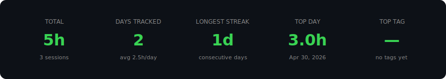
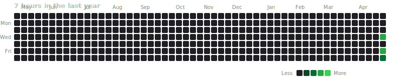

# punchcli

Minimal CLI time tracker. Logs sessions to SQLite, generates a Markdown report
you can link from any repo.



- Per-project: storage lives in `.punch/` at the repo root, found via walk-up
  like `git`.
- Python 3.11+, stdlib + [`argcomplete`](https://pypi.org/project/argcomplete/)
  + [`pygal`](https://www.pygal.org/) for SVG charts.
- SQLite for history, JSON for the active session, Markdown + SVG for the report.
- Pipe-friendly: data → stdout, warnings → stderr.

```
$ punch in -m "parser fix" -t backend,bug
⏱  Started tracking at 10:00 — "parser fix" [backend, bug]

$ punch out
✓ Stopped — 1h 30m logged
```

---

## Install

```bash
uvx punchcli --version      # run without installing
# or
uv tool install punchcli    # global
# or
pip install punchcli
```

After `uv tool install`, the `punch` command is on your `PATH`. Update with
`uv tool upgrade punchcli`.

---

## Quick start

```bash
cd your-project
punch init                       # creates .punch/ at the repo root
punch in -m "review feedback" -t backend
# ...work...
punch out                        # logs the session, regenerates REPORT.md
punch report --week
```

`punch init` writes `.punch/.gitignore` to keep `state.json` out of version
control. `punch.db` and `REPORT.md` are committed by default — that's how you
get a per-repo report linkable from your main `README.md`.

---

## Commands

| Command | Purpose |
|---------|---------|
| `punch init` | Create `.punch/` and the database. |
| `punch in [-m MSG] [-t TAGS]` | Start tracking. Fails if a session is active. |
| `punch out` | Stop the active session, append a row, regenerate `REPORT.md`. |
| `punch status` | Show the active session. |
| `punch report [filters]` | Print a totals summary. `--write` regenerates `REPORT.md`. |
| `punch log [filters] [-n N]` | Print recent sessions as a table. |
| `punch tags` | List tags with totals and last-used date. |
| `punch edit ID [...]` | Update a logged entry. |
| `punch add [...]` | Backfill a past session. |
| `punch export --csv\|--md` | Export entries. |
| `punch import FILE [--dry-run] [--force]` | Bulk-import from CSV. |
| `punch chart [NAME]` | Render SVG charts. `--list` / `--list-styles` / `--all` / `--stdout`. |
| `punch skill` | Print bundled `SKILL.md`. |
| `punch completions <shell>` | Print shell completion script. |
| `punch --version` | Print version. |

### Filters (`report`, `log`, `export`)

| Flag | Description |
|------|-------------|
| `--today` | Sessions started today (local tz) |
| `--week` | Current ISO week (Mon–Sun) |
| `--month` | Current calendar month |
| `--from YYYY-MM-DD` | Inclusive lower bound |
| `--to YYYY-MM-DD` | Inclusive upper bound |
| `--tag NAME` | Sessions containing this tag |

### `punch in`

Message: max 256 chars, no newlines. Tags: lowercase `[a-z0-9_-]`, max 5.
State writes are atomic.

### `punch edit`

```bash
punch edit 42 --end "yesterday 16:30" -m "review wrap-up" -t backend
```

| Flag | Description |
|------|-------------|
| `--start TS` | New start timestamp |
| `--end TS` | New end timestamp |
| `-m, --message TEXT` | Use `""` to clear |
| `-t, --tags LIST` | Use `""` to clear |

### `punch add`

Backfill. Provide exactly two of `--from`, `--to`, `--duration`.

```bash
punch add --from "yesterday 09:00" --to "yesterday 10:30" -m "standup" -t meetings
punch add --duration 1h30m --to "14:00" -m "code review"
```

Overlaps prompt for confirmation. `--force` skips it.

### `punch import` / `punch export`

CSV columns: `id,started_at,ended_at,duration_s,message,tags`. `id` and
`duration_s` are recomputed on import. Imports run in a single transaction;
invalid rows are skipped with a warning.

| Flag | Description |
|------|-------------|
| `--dry-run` | Validate without writing |
| `--force` | Skip the overlap prompt |

---

## Timestamp formats

- ISO 8601 with offset: `2026-04-30T09:00:00+02:00`
- `YYYY-MM-DD HH:MM` (local tz)
- `HH:MM` (today, local tz)
- `today HH:MM` / `yesterday HH:MM`

Durations: `45m`, `2h`, `1h30m`.

---

## Data layout

```
your-project/
  .punch/
    .gitignore     # ignores state.json
    config.toml    # chart selection + style
    punch.db       # SQLite, source of truth
    state.json     # active session only (atomic writes)
    REPORT.md      # regenerated on punch out
    charts/        # generated SVGs
```

Discovery walks up from the cwd until it finds `.punch/`. Override with the
`PUNCH_DIR` env var.

### Schema

```sql
CREATE TABLE entries (
  id          INTEGER PRIMARY KEY AUTOINCREMENT,
  started_at  TEXT    NOT NULL,   -- ISO 8601 with offset
  ended_at    TEXT    NOT NULL,
  duration_s  INTEGER NOT NULL,
  message     TEXT,
  tags        TEXT                -- comma-separated lowercase
);
```

Migrations are tracked in `schema_version` and run on startup. Database opens
in WAL mode.

---

## Charts

Nine chart types. See **[CHARTS.md](CHARTS.md)** for previews rendered from
this repo's data.

Each chart is a standalone SVG you can embed in any Markdown file:

```md

```

```bash
punch chart --list
punch chart heatmap                 # write .punch/charts/heatmap.svg
punch chart heatmap --stdout
punch chart --all                   # ignores config
```

`punch out` and `punch report --write` only regenerate the charts in
`charts.enabled`.

### `.punch/config.toml`

```toml
[charts]
enabled = ["heatmap", "lifetime", "tag_donut", "dow_bars"]
style = "github"

[charts.heatmap]
weeks = 53
```

Styles: `github` (default), `punch`, plus pygal built-ins (`default`, `dark`,
`neon`, `light`, `clean`, `red_blue`, `dark_solarized`, `light_solarized`,
`dark_colorized`, `light_colorized`, `solid_color`, `turquoise`).

---

## Shell completion

```bash
# bash (~/.bashrc)
eval "$(punch completions bash)"

# zsh (~/.zshrc)
eval "$(punch completions zsh)"

# fish (~/.config/fish/config.fish)
punch completions fish | source
```

---

## Agent integration

`punch skill` prints a bundled `SKILL.md` for agent runners:

```bash
mkdir -p .claude/skills/punchcli
punch skill > .claude/skills/punchcli/SKILL.md
```

---

## Output streams

Data → stdout, warnings → stderr.

```bash
punch export --csv > sessions.csv          # only CSV in the file
punch export --csv 2> errors.log | wc -l
```

---

## Env vars

| Variable | Purpose |
|----------|---------|
| `PUNCH_DIR` | Override `.punch/` discovery. |

---

## Exit codes

| Code | Meaning |
|------|---------|
| `0` | Success |
| `1` | User error (bad args, no active session, validation) |
| `2` | I/O or database error |

---

## Scope

Single-user, single-machine. Concurrent users sharing one `.punch/` are not
supported — `state.json` is single-writer and `entries` has no user column.

---

## Development

```bash
uv sync
uv run pytest
```

---

## License

MIT.
